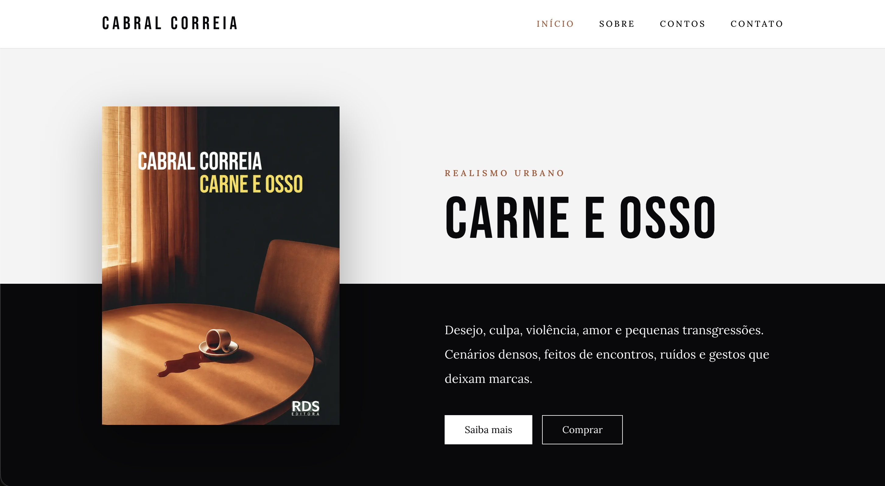

# Chi Akomas — Author Website



A personal website built with **Next.js**, **TypeScript**, and **Tailwind CSS** to showcase my literary work and my first published book, _Muted Masculity_.

Although I work professionally as a Senior Front-end Engineer, writing has been a lifelong passion. After publishing my first book, I decided to build a website dedicated to my literary career.

At the same time, I chose to make the project open source as a practical demonstration of how I structure modern React and Next.js applications, focusing on accessibility, maintainability, performance, testing, and clean architecture.

---

## Live Website

Production URL:

**https://www.cabralcorreia.com.br**

---

## About the Project

_Muted Masculity_ is a collection of 26 short stories written over a period of 22 years.

The website was designed to:

- Present the book and author
- Publish selected stories
- Provide contact information
- Serve as a public portfolio project demonstrating modern front-end practices

---

## Features

### Public Website

- Home page
- Author section
- Book page
- Selected stories
- Contact form
- Social links page
- Custom 404 page

### SEO

- Metadata API
- Open Graph tags
- Twitter Cards
- Semantic HTML

### Accessibility

- Keyboard navigation
- Skip link
- Focus-visible states
- ARIA attributes
- Semantic landmarks
- Accessible forms

### Performance

- Next.js Image Optimization
- Static generation
- Route-based code splitting
- Optimized font loading

### Testing

- Unit tests
- Component tests
- Form validation tests
- Accessibility-related tests

---

## Tech Stack

### Next.js

Framework used to build the application.

Why:

- App Router
- Server Components
- Static generation
- Metadata API
- Excellent developer experience

### TypeScript

Used throughout the entire codebase.

Why:

- Type safety
- Better maintainability
- Improved refactoring experience

### Tailwind CSS

Utility-first styling approach.

Why:

- Fast iteration
- Consistent design system
- Minimal CSS footprint

### React Hook Form

Form state management.

Why:

- Excellent performance
- Minimal re-renders
- Simple integration with validation libraries

### Zod

Schema validation.

Why:

- Type-safe validation
- Reusable business rules
- Seamless React Hook Form integration

### Jest

Testing framework.

Why:

- Mature ecosystem
- Excellent TypeScript support
- Reliable unit and component testing

### React Testing Library

Testing utilities focused on user behavior.

Why:

- Encourages testing from the user's perspective
- Reduces implementation-coupled tests

### Radix UI

Accessible primitives.

Why:

- Accessibility-first approach
- Headless components
- Full styling control

---

## Project Structure

```text
src/
├── app/
├── components/
│   ├── cards/
│   ├── layout/
│   ├── sections/
│   └── ui/
├── data/
├── lib/
├── types/
└── __tests__/
```

### Architecture Principles

- Reusable UI components
- Separation of concerns
- Type-safe data structures
- Accessibility-first mindset
- Testable code

---

## Running Locally

### Install dependencies

```bash
npm install
```

### Start development server

```bash
npm run dev
```

Application will be available at:

```text
http://localhost:3000
```

---

## Running Tests

Run all tests:

```bash
npm test
```

Run tests in watch mode:

```bash
npm test -- --watch
```

Generate coverage report:

```bash
npm test -- --coverage
```

---

## Accessibility Highlights

This project includes:

- Semantic HTML
- Accessible navigation
- Skip-to-content link
- Form validation feedback
- Keyboard navigation support
- Focus management
- ARIA attributes where appropriate

Accessibility was treated as a core feature rather than an afterthought.

---

## Author

**Thiago "Cabral" Correia**

Senior Front-end Engineer
Writer and Author of _Muted Masculity_

- Website: https://www.chiakomas.com
- Instagram: https://instagram.com/chiakomas
- Threads: https://www.threads.com/@chiakomas

---

## License

This project is licensed under the MIT License.
